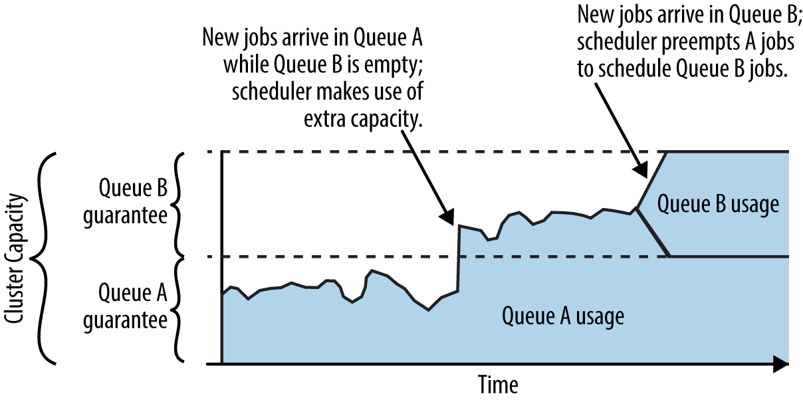

### Introduction
A *scheduler* is responsible for managing incoming container requests and determining which containers to run next, on which node to run them, and how many containers to run in parallel on the node.

Simplest scheduler : FIFO
Scheduling Goals:
1. Utilizing cluster resources as fully as possible.
2. Giving each user and group fair access to the cluster.
3. Ensuring that high-priority or latency sensitive jobs complete on time.

Multi-tenant distributed systems generally prioritize fairness among users and groups over optimal packing and maximal resource usage; without fairness, users would be likely to maximize their own access to the cluster without regard to others’ needs.

In the context of Hadoop, there are two commonly used schedulers, the **capacity scheduler** and the **fair scheduler**. Both schedulers have the concept of multiple queues of jobs to be scheduled, 
with admission to each queue determined based on user- or operator-specified policies.

Two level scheduling
Central scheduler that registers available resources and another scheduler doing the task of scheduling.

### Dominant Resource Fairness Scheduling

A policy called Dominant Resource Fairness (DRF)4 addresses these limitations by considering multiple resource types and expressing the usage of each resource in a common currency (the share of the total allocation of that resource), and then scheduling based on the resource each container is using most heavily.

### Aggressive Scehduling for Busy Queues

Often a multi-tenant cluster might be in a state where some but not all queues are full; that is, some tenants currently don’t have enough work to use their full share of the cluster, but others have more work than they are guaranteed based on the scheduler’s configured allocation. In such cases, the scheduler might launch more containers from the busy queues to keep the cluster fully utilized.

Preemption is a common feature in schedulers for multi-tenant distributed systems,

Because preemption inherently results in lost work, it’s important for the scheduler to strike a good balance between starting many opportunistic containers to make use of idle resources and avoiding too much preemption and the waste that it causes. To help reduce the negative impacts of preemption, the scheduler can slightly delay killing containers (to avoid wasting the work of containers that are almost complete) and generally chooses to kill containers that have recently launched (again, to avoid wasted work).

### Special Scheduling Treatment for Small jobs

Some cluster operators provide special treatment for small or fast jobs; in a sense, this is the opposite of preemption.

### Workload-Specific Scheduling Considerations

Aside from the general goals of high utilization and fairness across users and queues, schedulers might take other factors into account when deciding which containers to launch and where to run them.

1. Preference for data locality 
   Example, Hadoop scheduling, bringing the compute to the data.
   
2. Colocation and coscheduling for containers
    Example, Pods in K8s.
   
3. Gang scheduling
    Application requires all its resources to run concurrently, but they don't need to run on the same node. 
   Example, Distributed Database like Impala.
   
4. Workflow Schedulers
    Example, Oozie
   
### Inefficiencies in Scheduling

Although schedulers have become more sophisticated over time, they continue to suffer from inefficiencies related to the diversity of workloads running on multi-tenant distributed systems. These inefficiencies arise from the need to avoid overcommitting memory when doing up-front scheduling, a limited ability to consider all types of hardware resources, and challenges in considering the dependencies among all jobs and containers within complicated workflows.

1. Conservative with memory
   The need to be conservative with memory allocation means that most nodes will be underutilized most of the time; containers generally do not often use their theoretical maximum memory, and even when they do, it’s not for the full lifetime of the container 
   
2. Inability to effectively schedule the use of other resources
   Because CPU, disk, and network usage can change so quickly, it is impossible for any system that only does up-front scheduling to optimize cluster utilization and provide true fairness in the use of hardware resources.
   
3. Deadlock and Starvation
   In some cases, schedulers might choose to start some containers in a job’s DAG even before the preceding containers (the dependencies) have completed. This is done to reduce the total run time of the job or spread out resource usage over time.

A similar scheduling problem is starvation, which can occur on a heavily loaded cluster. For example, consider a case in which one job has containers that each need a larger amount of memory than containers from other jobs. When one of the small containers completes on a node, a naive scheduler will see that the node has a small amount of memory available, but because it can’t fit one of the large containers there, it will schedule a small container to run. In the extreme case, the larger containers might never be scheduled. 

4. Waste due to Speculative Execution
   scheduler can observe that a given container seems to be running more slowly than is typical for that kind of container and start another copy of that container on another node. While speculative execution can reduce job completion time due to node problems, it wastes resources when the container that is duplicated simply had more work to do than other containers and so naturally ran longer.

